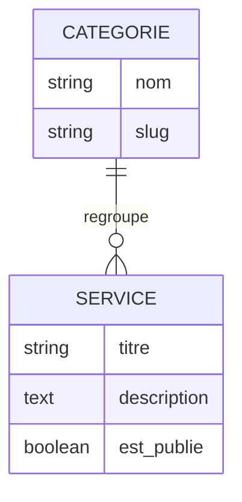
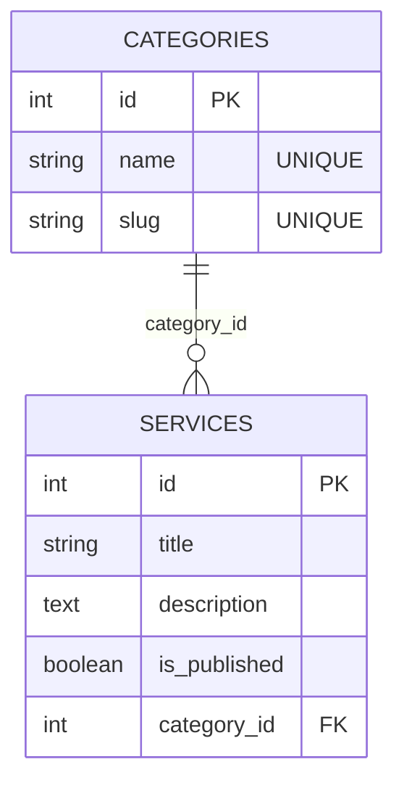

# Modélisation MERISE

> MERISE n'est appliqué qu'aux données **relationnelles** (PostgreSQL). MongoDB stocke des documents semi-structurés et ne suit pas cette méthode — la collection `testimonials` est documentée à la fin de ce document.

## 1. Modèle Conceptuel de Données (MCD)

Le MCD décrit les entités du domaine et leurs relations, indépendamment de toute technologie.

### Schéma (Mermaid)



### Description

- **CATEGORIE** : une catégorie regroupe plusieurs services (galerie filtrable, page Services). Identifiée par un `nom` lisible et un `slug` URL-safe.
- **SERVICE** : une prestation/produit présenté sur le site, rattaché à exactement **une** catégorie.

### Cardinalités

- Une catégorie peut regrouper **0 à n services**.
- Un service appartient à **exactement une (1, 1)** catégorie.

Relation : `CATEGORIE — regroupe — SERVICE` avec cardinalités `(0, n) — (1, 1)`.

## 2. Modèle Logique de Données (MLD)

Le MLD transforme le MCD en tables, attributs, clés primaires et clés étrangères, selon les règles de passage MCD → MLD.

### Schéma (Mermaid)



### Format textuel

```
CATEGORIES (
    #id : INT,
     name : VARCHAR(80) UNIQUE NOT NULL,
     slug : VARCHAR(80) UNIQUE NOT NULL
)

SERVICES (
    #id : INT,
     title : VARCHAR(120) NOT NULL,
     description : TEXT NOT NULL,
     is_published : BOOLEAN NOT NULL DEFAULT TRUE,
    =category_id : INT NOT NULL → CATEGORIES(id)
)
```

Notation utilisée :
- `#` devant la clé primaire
- `=` devant une clé étrangère
- La cible de la clé étrangère est indiquée par `→ TABLE(colonne)`

## 3. Modèle Physique de Données (MPD)

Le MPD est la traduction du MLD en script SQL exécutable sur PostgreSQL. Ce script est joué par `python seed/seed_postgres.py` via SQLAlchemy.

### Script SQL équivalent (généré par SQLAlchemy)

```sql
CREATE TABLE categories (
    id          SERIAL          PRIMARY KEY,
    name        VARCHAR(80)     NOT NULL UNIQUE,
    slug        VARCHAR(80)     NOT NULL UNIQUE
);

CREATE TABLE services (
    id              SERIAL          PRIMARY KEY,
    title           VARCHAR(120)    NOT NULL,
    description     TEXT            NOT NULL,
    is_published    BOOLEAN         NOT NULL DEFAULT TRUE,
    category_id     INTEGER         NOT NULL
                                    REFERENCES categories(id)
                                    ON DELETE CASCADE
);

CREATE INDEX idx_services_category_id ON services(category_id);
```

### Conventions

- Nommage : tables au **pluriel snake_case** (`categories`, `services`), colonnes en `snake_case`.
- Clés primaires : `SERIAL` (auto-incrément Postgres).
- Clés étrangères : suffixe `_id` (`category_id`).
- Booleans : préfixe `is_` (`is_published`).

## 4. Données non relationnelles — `testimonials` (MongoDB)

Les témoignages sont stockés dans MongoDB Atlas. Mongo est choisi parce que :

1. Les témoignages n'ont pas de relations vers d'autres entités.
2. Le contenu peut évoluer (ajout de champs sans migration).
3. Les requêtes principales sont des lectures simples sur des filtres plats.

### Structure d'un document

```json
{
    "_id": "ObjectId(...)",
    "author": "Alice Dupont",
    "comment": "Lorem ipsum dolor sit amet.",
    "rating": 5,
    "is_approved": true,
    "created_at": "ISODate(...)"
}
```

### Index recommandés

```js
db.testimonials.createIndex({ is_approved: 1, created_at: -1 })
```

Cet index accélère la requête publique `find({ is_approved: true }).sort({ created_at: -1 })`.
